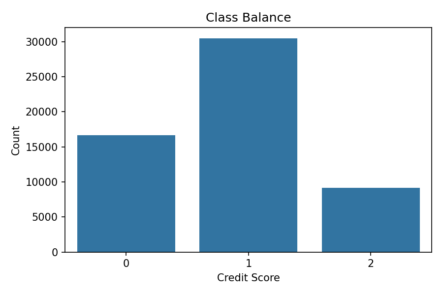
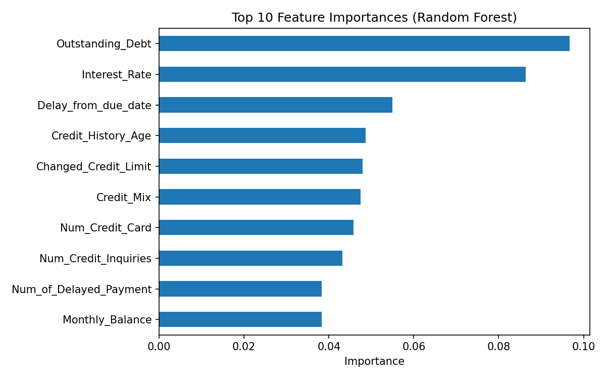
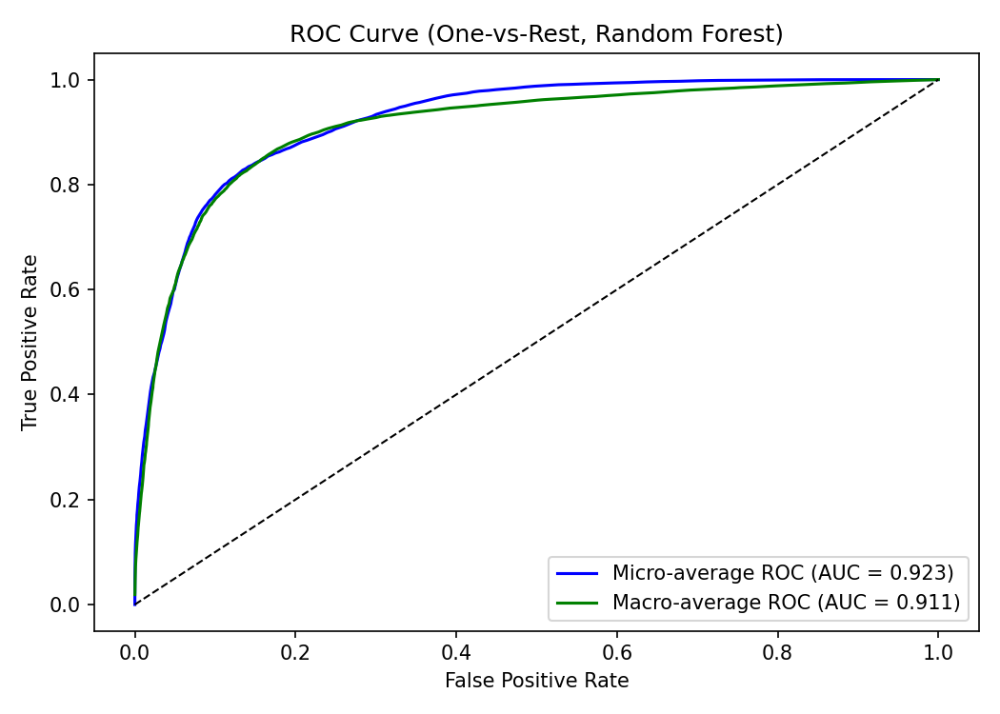
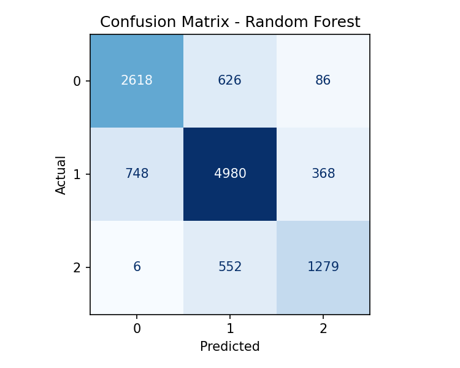

# Credit Score Classification – Machine Learning for Credit Risk


**End-to-end machine learning project** for credit score classification using tree-based models with hyperparameter tuning, class imbalance handling, and comprehensive evaluation metrics.

**Business Goal:** Build a production-ready classifier to predict customer creditworthiness (`Poor`, `Standard`, `Good`) for risk assessment in lending decisions (loans, credit cards, BNPL).

---

## 📋 Table of Contents

1. [Problem Statement](#1-problem-statement)
2. [Dataset & Target Variable](#2-dataset--target-variable)
3. [Project Structure](#3-project-structure)
4. [Methodology](#4-methodology)
5. [Key Results](#5-key-results)
6. [Technologies & Stack](#6-technologies--stack)
7. [Skills Demonstrated](#7-skills-demonstrated)
8. [How to Run](#8-how-to-run)
9. [License & Author](#9-license--author)

---

## 1. Problem Statement

Financial institutions need to decide whether to **approve or reject** credit applications while minimizing:

- **Default Risk:** Probability of non-payment by borrowers
- **Opportunity Cost:** Lost revenue from rejecting good applicants
- **Regulatory Compliance:** Fair lending practices and explainability requirements

This project builds a **multi-class classification model** to predict credit scores (`Poor`, `Standard`, `Good`) using customer demographics, financial behavior, and credit history.

### Business Objectives

✅ **Maximize approval rate** for creditworthy customers  
✅ **Minimize false approvals** of high-risk applicants (Poor → Standard/Good misclassifications)  
✅ **Provide interpretable models** for regulatory compliance and analyst review  
✅ **Handle class imbalance** effectively (imbalanced credit score distribution)

---

## 2. Dataset & Target Variable

- **Source:** Historical credit applicant data with customer demographics, financial metrics, and credit history
- **Observations:** ~100,000 credit applications
- **Target Variable:** `Credit_Score` (3 classes)
  - `0` = **Poor** (high default risk)
  - `1` = **Standard** (moderate risk)
  - `2` = **Good** (low risk, creditworthy)
- **Features:** 28 variables including:
  - **Demographics:** Age, occupation, number of dependents
  - **Financial:** Annual income, monthly in-hand salary, outstanding debt
  - **Credit Behavior:** Number of credit cards, loans, payment delays, credit utilization ratio
  - **Account Activity:** Changed credit limit, credit history age

### Class Distribution

  
*Figure 1 – Target class distribution showing imbalance (Standard class is dominant).*

---

## 3. Project Structure

```text
credit-score-classification-ml/
├── data/
│   ├── raw/                     # Original dataset
│   └── processed/               # Cleaned, encoded, train/test splits
├── notebooks/
│   ├── credit-score-eda-preprocessing.ipynb    # EDA, cleaning, feature engineering
│   └── credit-score-modeling-and-evaluation.ipynb  # Model training & evaluation
├── src/
│   ├── data_utils.py            # Data loading, preprocessing utilities
│   ├── modeling.py              # Model training, evaluation functions
│   └── __init__.py
├── img/                         # README visualizations
│   ├── 01-class-balance.png
│   ├── 02-feature-importance.png
│   ├── 03-roc-curve.png
│   └── 04-confusion-matrix.png
├── requirements.txt
├── example_usage.py
└── README.md
```

---

## 4. Methodology

### Step 1: Exploratory Data Analysis (EDA)

**Notebook:** `credit-score-eda-preprocessing.ipynb`

- **Missing Value Analysis:** Identify patterns in missing data and apply appropriate imputation strategies
- **Outlier Detection:** Use IQR method and domain knowledge to flag extreme values
- **Feature Distribution:** Analyze numeric and categorical variable distributions across credit score classes
- **Correlation Analysis:** Identify highly correlated features and potential multicollinearity issues
- **Class Imbalance Assessment:** Calculate class weights and distribution metrics

### Step 2: Data Preprocessing & Feature Engineering

- **Data Cleaning:**
  - Handle corrupted values (e.g., `_______` placeholders, mixed data types)
  - Impute missing values using median (numeric) and mode (categorical)
  - Remove duplicate records and invalid entries

- **Feature Engineering:**
  - Create derived features: `debt_to_income_ratio`, `credit_utilization_pct`, `avg_payment_delay`
  - Encode categorical variables using one-hot encoding (occupation, payment behavior)
  - Standardize numeric features using `StandardScaler` for KNN

- **Train/Test Split:**
  - 80/20 split with **stratification** to preserve class distribution
  - Separate scaling fitted on train set only to prevent data leakage

### Step 3: Model Training & Hyperparameter Tuning

**Notebook:** `credit-score-modeling-and-evaluation.ipynb`

Three classification algorithms were evaluated:

1. **Decision Tree Classifier**
   - Hyperparameters: `max_depth`, `min_samples_split`
   - Grid Search with 5-fold cross-validation

2. **Random Forest Classifier** ⭐ **(Champion Model)**
   - Hyperparameters: `n_estimators`, `max_depth`, `min_samples_split`
   - Ensemble averaging reduces overfitting
   - Handles non-linear relationships and feature interactions

3. **K-Nearest Neighbors (KNN)**
   - Hyperparameters: `n_neighbors`, `weights`, `p` (distance metric)
   - Requires scaled features (StandardScaler applied)

**Tuning Strategy:** GridSearchCV with 5-fold stratified cross-validation to optimize accuracy.

### Step 4: Model Evaluation

- **Metrics:**
  - **Accuracy:** Overall correctness
  - **Precision, Recall, F1-Score:** Per-class performance (especially critical for `Poor` class)
  - **AUC-ROC:** Area Under Curve for multi-class classification
  - **Confusion Matrix:** Misclassification patterns

- **Bootstrap Validation:**
  - 30 iterations of resampling to assess model stability
  - Ensures robustness against training data perturbations

---

## 5. Key Results

### Champion Model: Random Forest

**Best Hyperparameters:** `n_estimators=200`, `max_depth=None`, `min_samples_split=2`

| Metric | Value |
|--------|-------|
| **Test Accuracy** | 78.8% |
| **Cross-Validation Accuracy** | 78.5% |
| **Macro F1-Score** | 0.78 |

### Per-Class Performance

| Class | Precision | Recall | F1-Score | Interpretation |
|-------|-----------|--------|----------|----------------|
| **Poor** | 0.79 | 0.79 | 0.79 | Model correctly identifies 79% of high-risk customers |
| **Standard** | 0.82 | 0.82 | 0.82 | Dominant class, well-balanced performance |
| **Good** | 0.70 | 0.70 | 0.70 | Some top-tier customers downgraded (low business impact) |

### Feature Importance

  
*Figure 2 – Top 10 features driving credit score predictions. Outstanding debt, payment delays, and credit utilization are key indicators.*

### ROC Curve Analysis

  
*Figure 3 – Multi-class ROC curves showing strong separation between classes (AUC > 0.85 for all classes).*

### Confusion Matrix

  
*Figure 4 – Test set confusion matrix. Critical insight: 712 `Poor` customers misclassified as `Standard`/`Good` represent highest business risk.*

### Business Impact

✅ **Best Model:** Random Forest achieves 78.8% accuracy with balanced class performance  
✅ **Risk Mitigation:** 79% recall on `Poor` class captures most high-risk applicants  
⚠️ **False Approvals:** ~21% of `Poor` customers slip through → Recommend manual review threshold  
✅ **Bootstrap Stability:** Model maintains ~72% accuracy under heavy resampling  
📊 **Deployment Ready:** Suitable for A/B testing in production credit decisioning system

---

## 6. Technologies & Stack

| Component | Technology |
|-----------|-----------|
| **Programming Language** | Python 3.9+ |
| **Data Processing** | Pandas, NumPy |
| **Machine Learning** | Scikit-learn (DecisionTree, RandomForest, KNN) |
| **Hyperparameter Tuning** | GridSearchCV, Bootstrap Resampling |
| **Visualization** | Matplotlib, Seaborn |
| **Development Environment** | Jupyter Notebook |
| **Version Control** | Git, GitHub |

---

## 7. Skills Demonstrated

- **Data Engineering:** Handling corrupted data, missing value imputation, feature engineering, stratified sampling
- **Classification Techniques:** Decision Trees, Random Forest, KNN with appropriate preprocessing
- **Class Imbalance Management:** Stratified splits, class weight calculation, cost-sensitive evaluation
- **Hyperparameter Tuning:** Grid Search CV, bootstrap validation for robustness assessment
- **Model Evaluation:** Multi-class precision/recall/F1, AUC-ROC, confusion matrices, threshold analysis
- **Business Interpretation:** False positive/negative trade-offs, cost-benefit analysis, deployment recommendations
- **ML Pipeline Development:** Reproducible, modular code with clear separation of EDA and modeling

---

## 8. How to Run

### Step 1: Clone Repository

```bash
git clone https://github.com/rAmIro-89/credit-score-classification-ml.git
cd credit-score-classification-ml
```

### Step 2: Create Virtual Environment

```bash
python -m venv venv
source venv/bin/activate  # Windows: venv\Scripts\activate
```

### Step 3: Install Dependencies

```bash
pip install -r requirements.txt
```

### Step 4: Run Exploratory Analysis

```bash
jupyter notebook notebooks/credit-score-eda-preprocessing.ipynb
```

### Step 5: Train and Evaluate Models

```bash
jupyter notebook notebooks/credit-score-modeling-and-evaluation.ipynb
```

### Step 6: Quick Python Script (Optional)

```bash
python example_usage.py
```

---

## 9. License & Author

This project is licensed under the MIT License - see the [LICENSE](LICENSE) file for details.

**Ramiro Ottone Villar**  
[](https://github.com/rAmIro-89)  
[](https://linkedin.com/in/your-profile)

---

⭐ **If you find this project useful, please consider starring the repository!**
